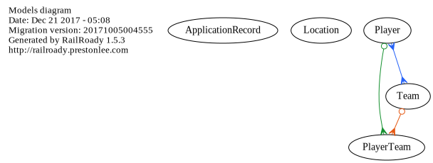

# Ruby on Rails Playground

[](https://travis-ci.org/ybiquitous/rails-playground)

## Stack

- Ruby 2.4
- Ruby on Rails 5.1
  - Factory Girl
- MySQL 5
- Yarn

## Install

```sh
bin/setup
```

## Run

```sh
bin/rails s
```

## Class Diagram

```sh
bin/rails diagram:all
```

### Model



### Controller


